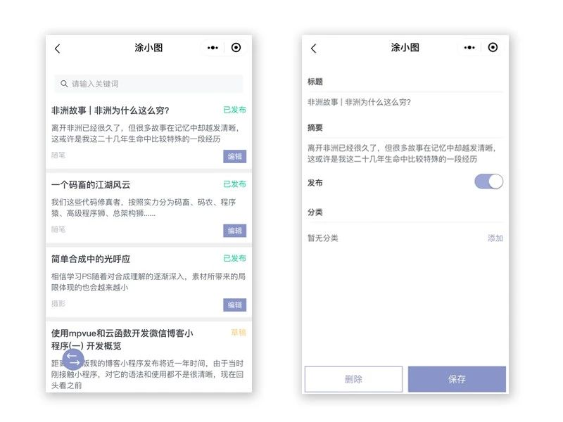

# 微信小程序个人博客（miniCalculator）

> 本项目使用小程序框架mpvue扩展的微信小程序博客，内容包括博客列表详情展示，评论点赞展示，相关后台管理。


## 项目运行

```
  git clone https://github.com/tujindong/miniblog.git
  cd miniCalculator_master(进入项目)
  npm install (安装依赖包)
  npm start (启动服务)
```

## 扫码体验


## 内容示例




## 目录结构
```
  miniblog
  ├── package.json //项目的主配置文件，包含mpvue项目的基本描述信息、项目所依赖的各种第三方库以及版本信息、以及可执行的脚本信息
  ├── project.config.json //在微信开发者工具中导入小程序项目的时候主要是通过该配置文件读取和写入配置信息。
  ├── static //小程序本地静态资源  云函数也在此目录下的functions内       
  ├── src
  |    ├── components // 包含一些独立的组件
  │    ├── pages
  |    │     ├── index //主页也就是博客列表页面
  |    │     ├── contactMe //联系作者页面
  |    │     ├── postDetail // 博客详情页面
  |    │     ├── participation // 我参与的页面
  |    │     ├── mine // 个人中心页面
  |    │     ├── version // 历史版本页面
  │    |     └── admin // 后台管理一系列页面
  │    ├── utils //一些公用工具函数
  │    ├── App.vue
  │    └── main.js
  ├── config //包含了用于开发和生产环境下的不同配置
  │   ├── index.js
  │   ├── dev.env.js
  │   └── prod.env.js
  └── build //用于项目编译打包的node.js脚本和webpack配置文件
```

## 功能

### 前台展示

- 文章列表详情展示。
- 文章分类切换。
- 点赞 评论 转发。
- 我评论的 我点赞的列表详情展示。

### 后台管理

- 文章管理：文章的编辑、删除、添加分类、同步微信公众号文章。
- 分类管理：分类的添加、编辑、删除。
- 版本管理：版本信息的添加、删除。
- 用户管理：管理员授权解除。
- 评论管理：评论审核、回复、删除。

### 云函数编写

登录用户信息录入，云函数服务端调用、获取开放数据

****
	
|Author|涂小图|
|---|---
|E-mail|1965382331@qq.com

****
